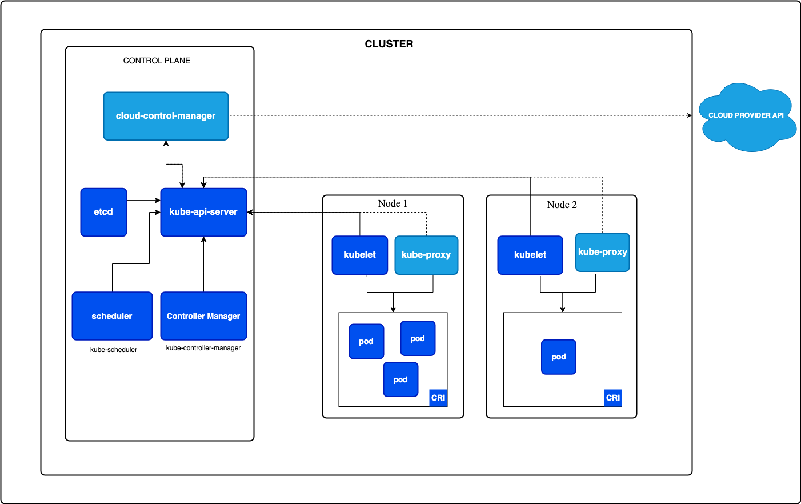

<!-- TOC -->
  * [Control Plane 控制平面](#control-plane-控制平面)
    * [kube-apiserver](#kube-apiserver)
    * [etcd](#etcd)
    * [kube-scheduler](#kube-scheduler)
    * [kube-controller-manager](#kube-controller-manager)
  * [node 组件](#node-组件)
    * [kubelet](#kubelet)
    * [kube-proxy](#kube-proxy)
    * [容器运行时（Container Runtime）](#容器运行时container-runtime)
<!-- TOC -->

## Control Plane 控制平面

控制平面组件会为集群做出全局决策，比如资源的调度。 以及检测和响应集群事件，例如当不满足部署的 replicas 字段时， 要启动新的
pod）。

### kube-apiserver

API 服务器是 Kubernetes 控制平面的组件， 该组件负责公开了 Kubernetes API，负责处理接受请求的工作。 API 服务器是
Kubernetes 控制平面的前端。

- 端口 8080
- 端口 6443

### [etcd](https://etcd.io/docs/)

一致且高可用的**键值存储**，用作 Kubernetes 所有集群数据的后台数据库。

### kube-scheduler

kube-scheduler 是控制平面的组件， 负责监视新创建的、未指定运行节点（node）的 Pods， 并选择节点来让 Pod 在上面运行。

### kube-controller-manager

kube-controller-manager 是控制平面的组件， 负责运行控制器进程。

从逻辑上讲， 每个控制器都是一个单独的进程， 但是为了降低复杂性，它们都被编译到同一个可执行文件，并在同一个进程中运行。

这些控制器包括：

- 节点控制器（Node Controller）：负责在节点出现故障时进行通知和响应
- 任务控制器（Job Controller）：监测代表一次性任务的 Job 对象，然后创建 Pods 来运行这些任务直至完成
- 端点分片控制器（EndpointSlice controller）：填充端点分片（EndpointSlice）对象（以提供 Service 和 Pod 之间的链接）。
- 服务账号控制器（ServiceAccount controller）：为新的命名空间创建默认的服务账号（ServiceAccount）。

## node 组件

节点组件会在**每个节点**上运行，负责维护运行的 Pod 并提供 Kubernetes 运行环境。

### kubelet

kubelet 会在集群中每个节点（node）上运行。 它保证容器（containers）都运行在 Pod 中。

### kube-proxy

kube-proxy 是集群中每个节点（node）上所运行的网络代理， 实现 Kubernetes 服务（Service） 概念的一部分。

### 容器运行时（Container Runtime）

容器运行环境是负责运行容器的软件。 
Kubernetes 支持许多容器运行环境，例如 containerd、 CRI-O 以及 Kubernetes CRI (容器运行环境接口) 的其他任何实现。

